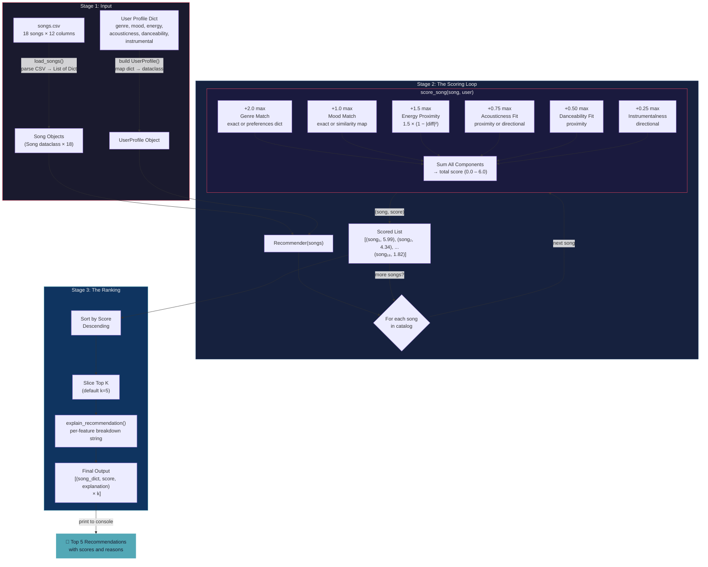

# 🎵 Music Recommender Simulation

## Project Summary

In this project you will build and explain a small music recommender system.

Your goal is to:

- Represent songs and a user "taste profile" as data
- Design a scoring rule that turns that data into recommendations
- Evaluate what your system gets right and wrong
- Reflect on how this mirrors real world AI recommenders

This version implements a content-based music recommender that scores a catalog of 18 songs against a user's taste profile using six weighted features: genre (+2.0), mood (+1.0), energy (+1.5), acousticness (+0.75), danceability (+0.5), and instrumentalness (+0.25) for a maximum score of 6.0. It uses proximity-based scoring for numerical features, exact and similarity matching for categorical features, and multi-genre affinity for cross-genre discovery. All songs are ranked and the top k recommendations are returned with human-readable explanations.

### Sample Output

Terminal output for the **Pop Enthusiast** profile (`genre=pop, mood=happy, energy=0.8`):

```
+----------------------------------------------------------+
|                       Pop Enthusiast                       |
+----------------------------------------------------------+
|  Genre: pop          Mood: happy        Energy: 0.8     |
|  Affinities: pop (1.0), indie pop (0.7), electronic (0.3)|
|  acoustic=0.2, dance=0.82, instrumental=False            |
+----------------------------------------------------------+

  #1  Sunrise City -- Neon Echo
       pop / happy
       5.99 / 6.0 pts
       Reasons:
         + genre match (pop) +2.00
         + mood match (happy) +1.00
         + energy proximity +1.50
         + acousticness fit +0.75
         + danceability fit +0.50
         + instrumental fit +0.24

  #2  Rooftop Lights -- Indigo Parade
       indie pop / happy
       5.36 / 6.0 pts
       Reasons:
         + similar genre (indie pop) +1.40
         + mood match (happy) +1.00
         + energy proximity +1.50
         + acousticness fit +0.73
         + danceability fit +0.50
         + instrumental fit +0.23

  #3  Gym Hero -- Max Pulse
       pop / intense
       4.95 / 6.0 pts
       Reasons:
         + genre match (pop) +2.00
         + energy proximity +1.47
         + acousticness fit +0.73
         + danceability fit +0.50
         + instrumental fit +0.24

  #4  Neon Bounce -- DJ Chromatic
       electronic / energetic
       3.97 / 6.0 pts
       Reasons:
         + similar genre (electronic) +0.60
         + similar mood (energetic) +0.60
         + energy proximity +1.49
         + acousticness fit +0.73
         + danceability fit +0.49
         + instrumental fit +0.05

  #5  Groove Theory -- Brass Circuit
       funk / uplifting
       3.74 / 6.0 pts
       Reasons:
         + similar mood (uplifting) +0.80
         + energy proximity +1.50
         + acousticness fit +0.75
         + danceability fit +0.50
         + instrumental fit +0.20
```

---

## How The System Works

Real-world platforms like Spotify and YouTube Music use two main approaches to recommend songs. Collaborative filtering looks at what millions of other users with similar listening habits enjoyed and suggests songs you haven't heard yet. Content-based filtering ignores other users entirely and instead analyzes the audio attributes of songs — tempo, energy, mood, danceability — to find tracks that sound like what you already love. Production systems combine both into hybrid models, layered with contextual signals like time of day and listening device. Our simulation focuses on content-based filtering: we score each song in the catalog against a user's stated preferences using a weighted formula, then rank and return the top matches. This keeps the system transparent and explainable — every recommendation can be traced back to specific feature matches rather than opaque user-behavior patterns.

### Song Features

Each `Song` object carries the following attributes used for scoring:

| Feature | Type | Role |
|---|---|---|
| `genre` | Categorical (e.g. pop, lofi, rock) | Primary filter — defines the structural identity of the music |
| `mood` | Categorical (e.g. happy, chill, intense) | Secondary filter — captures emotional tone and listening intent |
| `energy` | Float 0.0–1.0 | Continuous signal — measures intensity and activity level |
| `acousticness` | Float 0.0–1.0 | Continuous signal — indicates acoustic vs. electronic production |
| `danceability` | Float 0.0–1.0 | Continuous signal — suitability for dancing |
| `instrumentalness` | Float 0.0–1.0 | Continuous signal — likelihood of no vocals |

Two additional attributes (`title`, `artist`) serve as identifiers and are not used in scoring. `tempo_bpm`, `valence`, and `speechiness` are available in the dataset but excluded from scoring because they correlate strongly with features already scored.

### UserProfile Preferences

Each `UserProfile` stores core preferences plus optional extended fields:

**Core fields:**

| Preference | Type | Maps To |
|---|---|---|
| `favorite_genre` | String | `Song.genre` — exact match |
| `favorite_mood` | String | `Song.mood` — exact or similarity match |
| `target_energy` | Float 0.0–1.0 | `Song.energy` — proximity scoring |
| `likes_acoustic` | Boolean | `Song.acousticness` — directional fallback |

**Extended fields (optional):**

| Preference | Type | Maps To |
|---|---|---|
| `genre_preferences` | Dict of genre → weight | Multi-genre affinity with partial credit |
| `target_acousticness` | Float 0.0–1.0 | `Song.acousticness` — proximity scoring (overrides boolean) |
| `target_danceability` | Float 0.0–1.0 | `Song.danceability` — proximity scoring |
| `prefers_instrumental` | Boolean | `Song.instrumentalness` — directional scoring |

### Scoring and Ranking

The recommender uses a two-step process:

1. **Scoring Rule** (per song): Each song earns additive points up to a maximum of 6.0:

   `score = genre_pts + mood_pts + energy_pts + acoustic_pts + dance_pts + instrumental_pts`

   | Component | Max Points | Method |
   |---|---|---|
   | Genre | +2.00 | Exact match = 2.0, or `genre_preferences[song.genre] × 2.0` |
   | Mood | +1.00 | Exact match = 1.0, or `MOOD_SIMILARITY × 1.0` for partial credit |
   | Energy | +1.50 | `1.5 × (1 - \|song.energy - user.target_energy\|²)` |
   | Acousticness | +0.75 | `0.75 × (1 - \|song.acousticness - user.target\|²)` or directional |
   | Danceability | +0.50 | `0.5 × (1 - \|song.danceability - user.target\|²)` |
   | Instrumentalness | +0.25 | `0.25 × song.instrumentalness` (or `1 - value`) |

2. **Ranking Rule** (per list): All scored songs are sorted in descending order, and the top *k* results are returned as recommendations.

### Data Flow

The system follows a three-stage pipeline: **Input**, **Process**, and **Output**. Here is the written map of how data moves through the system:

**Stage 1 — Input (Load Data)**

Two independent data sources are loaded before any computation begins. The song catalog is read from `data/songs.csv` via `load_songs()`, which parses each CSV row into a dictionary with typed numeric fields. The user taste profile is defined as a dictionary in `main.py` containing genre, mood, energy targets, and optional extended preferences. These two inputs are completely independent — neither knows about the other until the process stage.

**Stage 2 — Process (The Scoring Loop)**

The `recommend_songs()` function converts each song dictionary into a `Song` object and the user dictionary into a `UserProfile` object, then constructs a `Recommender` instance. The recommender iterates over every song in the catalog and runs it through `score_song()`, which calls six independent scoring helpers in sequence. For a single song, the journey looks like this: the genre is compared against the user's `genre_preferences` dictionary (or exact-matched against `favorite_genre`), earning up to +2.0 points. The mood is checked for an exact match first (worth +1.0), and on a miss, the `MOOD_SIMILARITY` map is consulted for partial credit. The energy value is run through the proximity formula `1.5 × (1 - |diff|²)`, rewarding closeness to the user's target rather than raw magnitude. Acousticness, danceability, and instrumentalness each contribute their own points through the same proximity or directional logic. The six component scores are summed into a single total between 0.0 and 6.0. This entire process repeats for every song, producing a list of `(song, score)` pairs.

**Stage 3 — Output (The Ranking)**

The scored list is sorted in descending order by total score. The top *k* songs are sliced off. For each winner, `explain_recommendation()` regenerates the per-feature breakdown into a human-readable string. The final output is a list of `(song_dict, score, explanation)` tuples printed to the console.

### Data Flow Diagram



#### Tracing a Single Song Through the Pipeline

To verify the diagram, here is how **Sunrise City** (id=1) moves through the system for the **Pop Enthusiast** profile:

```
CSV Row → {"id":1, "title":"Sunrise City", "genre":"pop", "mood":"happy", "energy":0.82, ...}
                                            │
                                    load_songs() parses types
                                            │
                                            ▼
Song Object → Song(id=1, title="Sunrise City", genre="pop", mood="happy", energy=0.82,
                   acousticness=0.18, danceability=0.79, instrumentalness=0.05, ...)
                                            │
                          Recommender.score_song(song, user)
                                            │
              ┌─────────────────────────────┼─────────────────────────────┐
              │             │               │              │              │              │
         Genre Match   Mood Match   Energy Prox.   Acoustic Fit   Dance Fit   Instrumental
         pop == pop    happy==happy  1−|.82−.80|²  1−|.18−.20|²   1−|.79−.82|²  (1−0.05)×0.25
          = 2.00        = 1.00       = 1.4994       = 0.7497       = 0.4996      = 0.2375
              │             │               │              │              │              │
              └─────────────┴───────────────┼──────────────┴──────────────┘──────────────┘
                                            │
                                       Sum = 5.99
                                            │
                              Added to scored list at position
                                            │
                                            ▼
                        Sorted: Sunrise City (5.99) → Rank #1
                                            │
                                  Top k=5? Yes → included
                                            │
                                            ▼
            explain_recommendation() → "Score 5.99/6.0: genre match (pop) +2.00,
            mood match (happy) +1.00, energy proximity +1.50, acousticness fit +0.75,
            danceability fit +0.50, instrumental fit +0.24"
```

---

## Getting Started

### Setup

1. Create a virtual environment (optional but recommended):

   ```bash
   python -m venv .venv
   source .venv/bin/activate      # Mac or Linux
   .venv\Scripts\activate         # Windows

2. Install dependencies

```bash
pip install -r requirements.txt
```

3. Run the app:

```bash
python -m src.main
```

### Running Tests

Run the starter tests with:

```bash
pytest
```

You can add more tests in `tests/test_recommender.py`.

---

## System Evaluation

We tested the recommender against 3 standard profiles and 4 adversarial edge cases. Each profile ran against all 18 songs and returned the top 5.

### Standard Profiles

#### 1. High-Energy Pop (`genre=pop, mood=happy, energy=0.85`)

```
  #1  Sunrise City -- Neon Echo           5.98 / 6.0 pts
  #2  Rooftop Lights -- Indigo Parade     5.34 / 6.0 pts
  #3  Gym Hero -- Max Pulse               4.97 / 6.0 pts
  #4  Neon Bounce -- DJ Chromatic         3.99 / 6.0 pts
  #5  Groove Theory -- Brass Circuit      3.74 / 6.0 pts
```

**Intuition check:** Feels right. Sunrise City (pop/happy/0.82 energy) is the obvious best match and scores near-perfect. Rooftop Lights (indie pop/happy) ranks #2 via the genre affinity map — a listener who loves pop would likely enjoy indie pop. Gym Hero is pop but intense, not happy, so it loses the +1.0 mood points and drops to #3. The gap between #3 (4.97) and #4 (3.99) shows the genre cliff working correctly — once we leave the pop family, scores drop by a full point.

**Why Sunrise City ranked #1:**
- Genre match (pop): +2.00 (exact match — full genre points)
- Mood match (happy): +1.00 (exact match — full mood points)
- Energy proximity: +1.50 (|0.82 - 0.85|² = 0.0009, nearly zero penalty)
- Acousticness fit: +0.75 (|0.18 - 0.15|² = 0.0009)
- Danceability fit: +0.50 (|0.79 - 0.85|² = 0.0036)
- Instrumental fit: +0.24 ((1 - 0.05) × 0.25)
- **Total: 5.98** — only 0.02 away from the theoretical maximum

#### 2. Chill Lofi (`genre=lofi, mood=chill, energy=0.38`)

```
  #1  Library Rain -- Paper Lanterns      5.96 / 6.0 pts
  #2  Midnight Coding -- LoRoom           5.92 / 6.0 pts
  #3  Focus Flow -- LoRoom                5.57 / 6.0 pts
  #4  Spacewalk Thoughts -- Orbit Bloom   5.15 / 6.0 pts
  #5  Coffee Shop Stories -- Slow Stereo  5.04 / 6.0 pts
```

**Intuition check:** All 5 results feel like songs you'd hear on a "study beats" playlist. Library Rain and Midnight Coding are both lofi/chill — the 0.04pt gap comes from Library Rain's acousticness (0.86) being closer to the target (0.80) than Midnight Coding's (0.71). Focus Flow is lofi but "focused" instead of "chill" — the mood similarity map gives it 0.60 partial credit, which is correct (focused and chill are adjacent moods for study sessions). Spacewalk Thoughts (ambient) and Coffee Shop Stories (jazz) both surface via genre affinity — exactly the cross-genre discovery we designed for.

#### 3. Deep Intense Rock (`genre=rock, mood=intense, energy=0.92`)

```
  #1  Storm Runner -- Voltline            5.97 / 6.0 pts
  #2  Code Red -- Iron Syntax             5.34 / 6.0 pts
  #3  Gym Hero -- Max Pulse               3.96 / 6.0 pts
  #4  Neon Bounce -- DJ Chromatic         3.46 / 6.0 pts
  #5  Night Drive Loop -- Neon Echo       3.39 / 6.0 pts
```

**Intuition check:** Storm Runner (rock/intense/0.91 energy) is the perfect match. Code Red (metal/aggressive) ranks #2 because the profile has `metal: 0.8` in genre preferences and the mood similarity map connects aggressive→intense at 0.8. This is musically correct — a rock fan would very likely enjoy metal. The 1.63pt drop from #2 to #3 shows the boundary clearly: after rock and metal, nothing else in the catalog shares the genre family.

### Adversarial / Edge-Case Profiles

#### 4. EDGE: High-Energy Sad (`energy=0.95, mood=melancholy, genre=classical`)

```
  #1  Winter Sonata -- Ivory Keys         5.35 / 6.0 pts
  #2  Spacewalk Thoughts -- Orbit Bloom   3.30 / 6.0 pts
  #3  Golden Hour -- Amber Wave           3.06 / 6.0 pts
  #4  Night Drive Loop -- Neon Echo       2.98 / 6.0 pts
  #5  Velvet Whisper -- Luna Silk         2.60 / 6.0 pts
```

**What this tests:** Can mood and energy be contradictory? Melancholy songs in the catalog have low energy (Winter Sonata 0.30), but the user wants 0.95. No song satisfies both.

**What happened:** Winter Sonata still wins because it matches on genre (classical: +2.00) and mood (melancholy: +1.00), which together total +3.00 — enough to overcome the energy penalty. Its energy proximity score is only +0.87 (instead of the usual ~1.50 for close matches), confirming the penalty is real. But categorical matches outweigh the energy miss because genre (2.0) + mood (1.0) > energy (1.5 max). The system resolves the conflict by prioritizing genre identity over energy fit, which is arguably the right call — a sad classical listener would rather hear the right genre at the wrong tempo than the wrong genre at the right tempo.

**The 2.05pt gap** between #1 (5.35) and #2 (3.30) shows how dependent this profile is on a single song. Remove Winter Sonata from the catalog and the system has nothing good to offer.

#### 5. EDGE: Ghost Genre (`genre=reggae` — not in catalog)

```
  #1  Rooftop Lights -- Indigo Parade     3.97 / 6.0 pts
  #2  Sunrise City -- Neon Echo           3.96 / 6.0 pts
  #3  Groove Theory -- Brass Circuit      3.72 / 6.0 pts
  #4  Barrio Nights -- Sol Fuego          3.48 / 6.0 pts
  #5  Neon Bounce -- DJ Chromatic         3.29 / 6.0 pts
```

**What this tests:** What happens when zero songs match the user's genre? The genre_preferences dict only contains `{"reggae": 1.0}`, so every song scores 0.0 on genre.

**What happened:** The system degrades gracefully. With genre eliminated (0 out of 2.0 for all songs), the maximum possible score drops to 4.0 and mood becomes the primary discriminator. The top 2 songs are both "happy" (exact mood match for +1.00). The scores are compressed into a narrow 3.29–3.97 range because all songs are competing on the same 4.0-point budget. No song dominates, which is the correct behavior — when the system can't serve the user's core preference, it honestly signals that through lower scores rather than faking confidence.

#### 6. EDGE: Acoustic Electronic (`genre=electronic, acousticness=0.90`)

```
  #1  Spacewalk Thoughts -- Orbit Bloom   4.81 / 6.0 pts
  #2  Neon Bounce -- DJ Chromatic         4.03 / 6.0 pts
  #3  Library Rain -- Paper Lanterns      3.61 / 6.0 pts
  #4  Midnight Coding -- LoRoom           3.57 / 6.0 pts
  #5  Velvet Whisper -- Luna Silk         3.56 / 6.0 pts
```

**What this tests:** Electronic music is almost never acoustic. Can the system find a compromise?

**What happened:** Spacewalk Thoughts (ambient) wins — not because of genre match, but because ambient gets 0.6 genre affinity credit (+1.20), plus it has the highest acousticness in the catalog (0.92). Neon Bounce is the only actual electronic song and ranks #2, but its near-zero acousticness (0.04) earns only +0.20 on that component vs. Spacewalk's +0.75. The system chose the song that best balances the contradictory requirements rather than blindly prioritizing genre. This is a defensible trade-off.

#### 7. EDGE: The Middleground (`energy=0.5, acousticness=0.5, danceability=0.5`)

```
  #1  Sunrise City -- Neon Echo           4.48 / 6.0 pts
  #2  Gym Hero -- Max Pulse               4.25 / 6.0 pts
  #3  Midnight Coding -- LoRoom           3.70 / 6.0 pts
  #4  Library Rain -- Paper Lanterns      3.62 / 6.0 pts
  #5  Spacewalk Thoughts -- Orbit Bloom   3.54 / 6.0 pts
```

**What this tests:** A user with no strong opinions — everything at 0.5. Does genre weight dominate?

**What happened:** Yes, genre dominates. Sunrise City and Gym Hero are both pop and rank #1-2 purely because genre match (+2.00) outweighs everything else when all numeric features cluster around 0.5. The system correctly gives pop songs the top spots (genre=pop was set), then falls back to chill mood matches (#3-5). This confirms that with neutral numeric preferences, categorical features drive the ranking — which is by design.

### Diversity Check: Does One Song Dominate?

| Profile | #1 Song | Score |
|---|---|---|
| High-Energy Pop | Sunrise City | 5.98 |
| Chill Lofi | Library Rain | 5.96 |
| Deep Intense Rock | Storm Runner | 5.97 |
| EDGE: High-Energy Sad | Winter Sonata | 5.35 |
| EDGE: Ghost Genre | Rooftop Lights | 3.97 |
| EDGE: Acoustic Electronic | Spacewalk Thoughts | 4.81 |
| EDGE: The Middleground | Sunrise City | 4.48 |

**6 unique songs** at #1 across 7 profiles. Sunrise City appears twice (standard pop + middleground) because the Middleground profile has `genre=pop` — it's the system correctly applying genre weight, not a bias. No single song dominates all lists, confirming the weights and dataset provide sufficient variety.

### Weight Shift Experiment

We tested the system's sensitivity by **doubling energy weight** (1.5 to 3.0) and **halving genre weight** (2.0 to 1.0):

| Profile | Original #1 (genre=2.0) | Experimental #1 (genre=1.0) | Changed? |
|---|---|---|---|
| High-Energy Pop | Sunrise City (5.98) | Sunrise City (6.48) | No |
| Chill Lofi | Library Rain (5.96) | Library Rain (6.46) | No |
| Deep Intense Rock | Storm Runner (5.97) | Storm Runner (6.47) | No |
| EDGE: The Middleground | **Sunrise City** (4.48) | **Midnight Coding** (5.19) | **Yes** |
| EDGE: Acoustic Electronic | Spacewalk Thoughts (4.81) | Spacewalk Thoughts (5.64) | No |

**Key finding:** Standard profiles were stable — the #1 song did not change because the best match wins on all features simultaneously. The Middleground profile was the most sensitive: when genre dropped from 2.0 to 1.0, the pop genre anchor was no longer strong enough to beat a lofi song with better energy proximity (0.42 vs 0.50 target = 0.0064 penalty vs 0.82 vs 0.50 = 0.1024 penalty). The experiment confirmed that the original genre=2.0 weight is appropriate for users with clear preferences but over-determines results for users with weak ones.

**Was it more accurate or just different?** For the Middleground profile, the experimental result (Midnight Coding) is arguably more accurate — a user with no strong genre preference and energy target of 0.50 should get a mid-energy song, not a high-energy pop track that happens to match genre. For all other profiles, the original weights produced better results because genre identity matters when the user has a real preference. We reverted to the original weights.

---

## Limitations and Risks

- **Tiny catalog (18 songs):** Some profiles only have 1 exact match. Remove that song and the system has nothing good to offer (e.g., the 2.05pt gap in High-Energy Sad).
- **Genre cliff:** The +2.0 genre weight creates a hard boundary. A song with 0 genre credit can almost never outscore a genre match, even if every other feature is a better fit.
- **Middle-energy blind spot:** Only 3 of 18 songs fall in the 0.50--0.74 energy range. Users wanting moderate energy are structurally underserved by the dataset, not the algorithm.
- **Genre-driven filter bubble:** Lofi and pop have 3 and 2 songs respectively; 13 genres have just 1 song. Lofi/pop users get rich recommendations while classical or folk listeners depend on a single match.
- **Hand-authored mood map:** If a mood is missing from `MOOD_SIMILARITY`, it gets zero partial credit. New moods need manual entries.
- **No lyric, language, or cultural understanding:** Two songs can have identical numeric features but completely different lyrical content.

See [model_card.md](model_card.md) for a deeper analysis.

---

## Reflection

[**Model Card**](model_card.md) | [**Profile Comparisons**](reflection.md)

Recommenders turn data into predictions by reducing songs and users to numbers, then computing similarity. The most important lesson from this project is that **weights are opinions disguised as math.** Setting genre to 2.0 points and mood to 1.0 is not an objective fact — it is a design decision that says "where a song comes from matters more than how it makes you feel." When we halved genre weight in the experiment, the Middleground user suddenly got lofi instead of pop. Neither result is wrong — they reflect different philosophies about what matters in music.

Bias shows up in two ways. First, **dataset bias**: lofi has 3 songs while classical has 1, so lofi listeners get variety while classical listeners get one match or nothing. A real platform with this imbalance would systematically serve some communities better than others. Second, **algorithmic bias**: the genre weight creates a filter bubble. The Ghost Genre experiment showed that removing genre signal actually produced the most diverse, discovery-oriented results. This suggests that the very feature most responsible for accuracy (genre matching) is also the one most responsible for limiting serendipity. Real platforms face this tension constantly — accuracy and diversity are often at odds.
