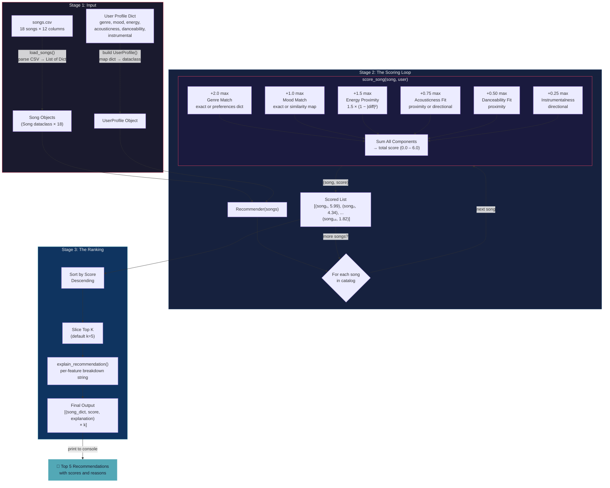

# 🎵 Music Recommender Simulation

## Project Summary

In this project you will build and explain a small music recommender system.

Your goal is to:

- Represent songs and a user "taste profile" as data
- Design a scoring rule that turns that data into recommendations
- Evaluate what your system gets right and wrong
- Reflect on how this mirrors real world AI recommenders

This version implements a content-based music recommender that scores a catalog of 18 songs against a user's taste profile using six weighted features: genre (+2.0), mood (+1.0), energy (+1.5), acousticness (+0.75), danceability (+0.5), and instrumentalness (+0.25) for a maximum score of 6.0. It uses proximity-based scoring for numerical features, exact and similarity matching for categorical features, and multi-genre affinity for cross-genre discovery. All songs are ranked and the top k recommendations are returned with human-readable explanations.

### Sample Output

Terminal output for the **Pop Enthusiast** profile (`genre=pop, mood=happy, energy=0.8`):

```
+----------------------------------------------------------+
|                       Pop Enthusiast                       |
+----------------------------------------------------------+
|  Genre: pop          Mood: happy        Energy: 0.8     |
|  Affinities: pop (1.0), indie pop (0.7), electronic (0.3)|
|  acoustic=0.2, dance=0.82, instrumental=False            |
+----------------------------------------------------------+

  #1  Sunrise City -- Neon Echo
       pop / happy
       5.99 / 6.0 pts
       Reasons:
         + genre match (pop) +2.00
         + mood match (happy) +1.00
         + energy proximity +1.50
         + acousticness fit +0.75
         + danceability fit +0.50
         + instrumental fit +0.24

  #2  Rooftop Lights -- Indigo Parade
       indie pop / happy
       5.36 / 6.0 pts
       Reasons:
         + similar genre (indie pop) +1.40
         + mood match (happy) +1.00
         + energy proximity +1.50
         + acousticness fit +0.73
         + danceability fit +0.50
         + instrumental fit +0.23

  #3  Gym Hero -- Max Pulse
       pop / intense
       4.95 / 6.0 pts
       Reasons:
         + genre match (pop) +2.00
         + energy proximity +1.47
         + acousticness fit +0.73
         + danceability fit +0.50
         + instrumental fit +0.24

  #4  Neon Bounce -- DJ Chromatic
       electronic / energetic
       3.97 / 6.0 pts
       Reasons:
         + similar genre (electronic) +0.60
         + similar mood (energetic) +0.60
         + energy proximity +1.49
         + acousticness fit +0.73
         + danceability fit +0.49
         + instrumental fit +0.05

  #5  Groove Theory -- Brass Circuit
       funk / uplifting
       3.74 / 6.0 pts
       Reasons:
         + similar mood (uplifting) +0.80
         + energy proximity +1.50
         + acousticness fit +0.75
         + danceability fit +0.50
         + instrumental fit +0.20
```

---

## How The System Works

Real-world platforms like Spotify and YouTube Music use two main approaches to recommend songs. Collaborative filtering looks at what millions of other users with similar listening habits enjoyed and suggests songs you haven't heard yet. Content-based filtering ignores other users entirely and instead analyzes the audio attributes of songs — tempo, energy, mood, danceability — to find tracks that sound like what you already love. Production systems combine both into hybrid models, layered with contextual signals like time of day and listening device. Our simulation focuses on content-based filtering: we score each song in the catalog against a user's stated preferences using a weighted formula, then rank and return the top matches. This keeps the system transparent and explainable — every recommendation can be traced back to specific feature matches rather than opaque user-behavior patterns.

### Song Features

Each `Song` object carries the following attributes used for scoring:

| Feature | Type | Role |
|---|---|---|
| `genre` | Categorical (e.g. pop, lofi, rock) | Primary filter — defines the structural identity of the music |
| `mood` | Categorical (e.g. happy, chill, intense) | Secondary filter — captures emotional tone and listening intent |
| `energy` | Float 0.0–1.0 | Continuous signal — measures intensity and activity level |
| `acousticness` | Float 0.0–1.0 | Continuous signal — indicates acoustic vs. electronic production |
| `danceability` | Float 0.0–1.0 | Continuous signal — suitability for dancing |
| `instrumentalness` | Float 0.0–1.0 | Continuous signal — likelihood of no vocals |

Two additional attributes (`title`, `artist`) serve as identifiers and are not used in scoring. `tempo_bpm`, `valence`, and `speechiness` are available in the dataset but excluded from scoring because they correlate strongly with features already scored.

### UserProfile Preferences

Each `UserProfile` stores core preferences plus optional extended fields:

**Core fields:**

| Preference | Type | Maps To |
|---|---|---|
| `favorite_genre` | String | `Song.genre` — exact match |
| `favorite_mood` | String | `Song.mood` — exact or similarity match |
| `target_energy` | Float 0.0–1.0 | `Song.energy` — proximity scoring |
| `likes_acoustic` | Boolean | `Song.acousticness` — directional fallback |

**Extended fields (optional):**

| Preference | Type | Maps To |
|---|---|---|
| `genre_preferences` | Dict of genre → weight | Multi-genre affinity with partial credit |
| `target_acousticness` | Float 0.0–1.0 | `Song.acousticness` — proximity scoring (overrides boolean) |
| `target_danceability` | Float 0.0–1.0 | `Song.danceability` — proximity scoring |
| `prefers_instrumental` | Boolean | `Song.instrumentalness` — directional scoring |

### Scoring and Ranking

The recommender uses a two-step process:

1. **Scoring Rule** (per song): Each song earns additive points up to a maximum of 6.0:

   `score = genre_pts + mood_pts + energy_pts + acoustic_pts + dance_pts + instrumental_pts`

   | Component | Max Points | Method |
   |---|---|---|
   | Genre | +2.00 | Exact match = 2.0, or `genre_preferences[song.genre] × 2.0` |
   | Mood | +1.00 | Exact match = 1.0, or `MOOD_SIMILARITY × 1.0` for partial credit |
   | Energy | +1.50 | `1.5 × (1 - \|song.energy - user.target_energy\|²)` |
   | Acousticness | +0.75 | `0.75 × (1 - \|song.acousticness - user.target\|²)` or directional |
   | Danceability | +0.50 | `0.5 × (1 - \|song.danceability - user.target\|²)` |
   | Instrumentalness | +0.25 | `0.25 × song.instrumentalness` (or `1 - value`) |

2. **Ranking Rule** (per list): All scored songs are sorted in descending order, and the top *k* results are returned as recommendations.

### Data Flow

The system follows a three-stage pipeline: **Input**, **Process**, and **Output**. Here is the written map of how data moves through the system:

**Stage 1 — Input (Load Data)**

Two independent data sources are loaded before any computation begins. The song catalog is read from `data/songs.csv` via `load_songs()`, which parses each CSV row into a dictionary with typed numeric fields. The user taste profile is defined as a dictionary in `main.py` containing genre, mood, energy targets, and optional extended preferences. These two inputs are completely independent — neither knows about the other until the process stage.

**Stage 2 — Process (The Scoring Loop)**

The `recommend_songs()` function converts each song dictionary into a `Song` object and the user dictionary into a `UserProfile` object, then constructs a `Recommender` instance. The recommender iterates over every song in the catalog and runs it through `score_song()`, which calls six independent scoring helpers in sequence. For a single song, the journey looks like this: the genre is compared against the user's `genre_preferences` dictionary (or exact-matched against `favorite_genre`), earning up to +2.0 points. The mood is checked for an exact match first (worth +1.0), and on a miss, the `MOOD_SIMILARITY` map is consulted for partial credit. The energy value is run through the proximity formula `1.5 × (1 - |diff|²)`, rewarding closeness to the user's target rather than raw magnitude. Acousticness, danceability, and instrumentalness each contribute their own points through the same proximity or directional logic. The six component scores are summed into a single total between 0.0 and 6.0. This entire process repeats for every song, producing a list of `(song, score)` pairs.

**Stage 3 — Output (The Ranking)**

The scored list is sorted in descending order by total score. The top *k* songs are sliced off. For each winner, `explain_recommendation()` regenerates the per-feature breakdown into a human-readable string. The final output is a list of `(song_dict, score, explanation)` tuples printed to the console.

### Data Flow Diagram



#### Tracing a Single Song Through the Pipeline

To verify the diagram, here is how **Sunrise City** (id=1) moves through the system for the **Pop Enthusiast** profile:

```
CSV Row → {"id":1, "title":"Sunrise City", "genre":"pop", "mood":"happy", "energy":0.82, ...}
                                            │
                                    load_songs() parses types
                                            │
                                            ▼
Song Object → Song(id=1, title="Sunrise City", genre="pop", mood="happy", energy=0.82,
                   acousticness=0.18, danceability=0.79, instrumentalness=0.05, ...)
                                            │
                          Recommender.score_song(song, user)
                                            │
              ┌─────────────────────────────┼─────────────────────────────┐
              │             │               │              │              │              │
         Genre Match   Mood Match   Energy Prox.   Acoustic Fit   Dance Fit   Instrumental
         pop == pop    happy==happy  1−|.82−.80|²  1−|.18−.20|²   1−|.79−.82|²  (1−0.05)×0.25
          = 2.00        = 1.00       = 1.4994       = 0.7497       = 0.4996      = 0.2375
              │             │               │              │              │              │
              └─────────────┴───────────────┼──────────────┴──────────────┘──────────────┘
                                            │
                                       Sum = 5.99
                                            │
                              Added to scored list at position
                                            │
                                            ▼
                        Sorted: Sunrise City (5.99) → Rank #1
                                            │
                                  Top k=5? Yes → included
                                            │
                                            ▼
            explain_recommendation() → "Score 5.99/6.0: genre match (pop) +2.00,
            mood match (happy) +1.00, energy proximity +1.50, acousticness fit +0.75,
            danceability fit +0.50, instrumental fit +0.24"
```

---

## Getting Started

### Setup

1. Create a virtual environment (optional but recommended):

   ```bash
   python -m venv .venv
   source .venv/bin/activate      # Mac or Linux
   .venv\Scripts\activate         # Windows

2. Install dependencies

```bash
pip install -r requirements.txt
```

3. Run the app:

```bash
python -m src.main
```

### Running Tests

Run the starter tests with:

```bash
pytest
```

You can add more tests in `tests/test_recommender.py`.

---

## Experiments You Tried

Use this section to document the experiments you ran. For example:

- What happened when you changed the weight on genre from 2.0 to 0.5
- What happened when you added tempo or valence to the score
- How did your system behave for different types of users

---

## Limitations and Risks

Summarize some limitations of your recommender.

Examples:

- It only works on a tiny catalog
- It does not understand lyrics or language
- It might over favor one genre or mood

You will go deeper on this in your model card.

---

## Reflection

Read and complete `model_card.md`:

[**Model Card**](model_card.md)

Write 1 to 2 paragraphs here about what you learned:

- about how recommenders turn data into predictions
- about where bias or unfairness could show up in systems like this


---

## 7. `model_card_template.md`

Combines reflection and model card framing from the Module 3 guidance. :contentReference[oaicite:2]{index=2}  

```markdown
# 🎧 Model Card - Music Recommender Simulation

## 1. Model Name

Give your recommender a name, for example:

> VibeFinder 1.0

---

## 2. Intended Use

- What is this system trying to do
- Who is it for

Example:

> This model suggests 3 to 5 songs from a small catalog based on a user's preferred genre, mood, and energy level. It is for classroom exploration only, not for real users.

---

## 3. How It Works (Short Explanation)

Describe your scoring logic in plain language.

- What features of each song does it consider
- What information about the user does it use
- How does it turn those into a number

Try to avoid code in this section, treat it like an explanation to a non programmer.

---

## 4. Data

Describe your dataset.

- How many songs are in `data/songs.csv`
- Did you add or remove any songs
- What kinds of genres or moods are represented
- Whose taste does this data mostly reflect

---

## 5. Strengths

Where does your recommender work well

You can think about:
- Situations where the top results "felt right"
- Particular user profiles it served well
- Simplicity or transparency benefits

---

## 6. Limitations and Bias

Where does your recommender struggle

Some prompts:
- Does it ignore some genres or moods
- Does it treat all users as if they have the same taste shape
- Is it biased toward high energy or one genre by default
- How could this be unfair if used in a real product

---

## 7. Evaluation

How did you check your system

Examples:
- You tried multiple user profiles and wrote down whether the results matched your expectations
- You compared your simulation to what a real app like Spotify or YouTube tends to recommend
- You wrote tests for your scoring logic

You do not need a numeric metric, but if you used one, explain what it measures.

---

## 8. Future Work

If you had more time, how would you improve this recommender

Examples:

- Add support for multiple users and "group vibe" recommendations
- Balance diversity of songs instead of always picking the closest match
- Use more features, like tempo ranges or lyric themes

---

## 9. Personal Reflection

A few sentences about what you learned:

- What surprised you about how your system behaved
- How did building this change how you think about real music recommenders
- Where do you think human judgment still matters, even if the model seems "smart"

